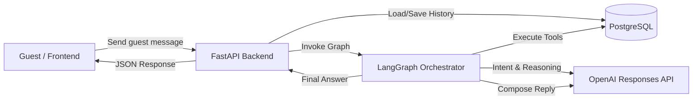

# StayEase AI Booking Agent

## Demo presentation of the system 

https://github.com/user-attachments/assets/9dd12cc5-603f-4efd-aa48-aa03ce748b1f


## 1. Architecture Document

### 1.1 System Overview
StayEase is a focused guest messaging backend for a short-term rental platform in Bangladesh. A guest sends a message to the FastAPI backend, the request is passed into a LangGraph orchestrator, and the agent uses the OpenAI Responses API with centralized prompts to decide whether to search properties, return listing details, create a booking, or escalate. Guests can identify properties by code (e.g., SEA-318) or by name (e.g., "Kolatoli Family Suite"). PostgreSQL stores listings, bookings, and conversation history.



### 1.2 Conversation Flow
Example user request: **"I need a room in Cox's Bazar for 2 nights for 2 guests."**

1. The guest message reaches `POST /api/chat/{conversation_id}/message`.
2. FastAPI loads prior conversation history from PostgreSQL and passes the latest turn into the LangGraph agent.
3. The routing node sends the guest message and recent context to the OpenAI Responses API with instructions that the agent may only search, show listing details, create a booking, or escalate.
4. The model classifies the request as a **search** intent and extracts:
   - `location = "Cox's Bazar"`
   - `guest_count = 2`
   - `stay_length = 2 nights`
5. If critical information is missing, the agent identifies **all** missing fields (e.g., dates, guest count, or name/email) and asks for them in a single, comprehensive message. The graph resumes the flow once the guest provides the missing details.
6. The `search_available_properties` tool queries PostgreSQL for active listings in Cox's Bazar that:
   - match the location
   - can host at least 2 guests
   - are not already booked for the requested stay window
7. The tool returns structured search results such as:
   - `SEA-201` — Beach View Studio — `BDT 6,800/night`
   - `SEA-318` — Kolatoli Family Suite — `BDT 8,500/night`
8. The agent sends those tool results back into the OpenAI Responses API.
9. The model turns the structured tool output into a guest-friendly final answer with prices and listing IDs.
10. FastAPI stores both the guest turn and assistant reply in `conversations` and returns the response payload to the frontend.

### 1.3 LangGraph State Design

| Field | Type | Why it is needed |
|---|---|---|
| `conversation_id` | `str` | Identifies the chat thread across API requests and persistence. |
| `messages` | `list[dict[str, str]]` | Carries recent user and assistant turns so the graph has conversation context. |
| `latest_user_message` | `str` | Gives the graph a stable copy of the newest guest message to classify. |
| `intent` | `Literal["search", "details", "book", "escalate"] \| None` | Stores the route selected by the graph. |
| `search_params` | `dict[str, Any]` | Holds normalized search inputs such as location, dates, and guest count. |
| `selected_listing_id` | `str \| None` | Tracks which listing the guest is asking about or booking. |
| `booking_request` | `dict[str, Any]` | Holds the structured payload used by the booking tool. |
| `tool_result` | `dict[str, Any] \| None` | Stores the latest tool response for later formatting. |
| `response_text` | `str \| None` | Stores the final assistant reply before it is returned to FastAPI. |
| `escalation_reason` | `str \| None` | Captures why the request should be handed to a human. |

### 1.4 Node Design

| Node | What it does | Updates in state | Next node |
|---|---|---|---|
| `route_request` | Detects whether the request is search, details, booking, or escalation. | `intent`, `search_params`, `selected_listing_id`, `booking_request`, `escalation_reason` | `run_search_tool`, `run_details_tool`, `run_booking_tool`, or `finalize_response` |
| `run_search_tool` | Calls the property search tool with normalized stay filters. | `tool_result` | `finalize_response` |
| `run_details_tool` | Calls the listing details tool for a selected property. | `tool_result` | `finalize_response` |
| `run_booking_tool` | Calls the booking tool when the guest confirms a reservation. | `tool_result` | `finalize_response` |
| `finalize_response` | Turns tool output or escalation state into the final assistant message. | `response_text`, `messages` | `END` |

### 1.5 Tool Definitions

#### `search_available_properties`
- **Input parameters**
  - `location: str`
  - `check_in: date`
  - `check_out: date`
  - `guest_count: int`
- **Output format**
```json
{
  "properties": [
    {
      "listing_id": "SEA-201",
      "title": "Beach View Studio",
      "location": "Cox's Bazar",
      "price_bdt": 6800,
      "currency": "BDT",
      "max_guests": 2,
      "available": true
    }
  ],
  "count": 1
}
```
- **Used when**
  - The agent has enough information to search for available stays.

#### `get_listing_details`
- **Input parameters**
  - `listing_id: str` (Accepts listing code or property name)
- **Output format**
```json
{
  "listing_id": "SEA-201",
  "title": "Beach View Studio",
  "description": "A clean studio near the sea beach with balcony access.",
  "location": "Cox's Bazar",
  "nightly_price_bdt": 6800,
  "amenities": ["WiFi", "AC", "Hot Water", "Breakfast"],
  "max_guests": 2,
  "check_in_time": "14:00",
  "check_out_time": "11:00"
}
```
- **Used when**
  - The guest asks about a specific listing.

#### `create_booking`
- **Input parameters**
  - `listing_id: str` (Accepts listing code or property name)
  - `check_in: date`
  - `check_out: date`
  - `guest_count: int`
  - `guest_name: str`
  - `guest_email: EmailStr`
- **Output format**
```json
{
  "booking_id": "BK-20260514-0001",
  "status": "confirmed",
  "listing_id": "SEA-201",
  "total_price_bdt": 13600,
  "currency": "BDT"
}
```
- **Used when**
  - The guest clearly confirms they want to complete a booking.

### 1.6 Database Schema Design

#### `listings`
| Column | Data type |
|---|---|
| `id` | `UUID PRIMARY KEY` |
| `listing_code` | `VARCHAR(32) UNIQUE NOT NULL` |
| `title` | `VARCHAR(150) NOT NULL` |
| `description` | `TEXT NOT NULL` |
| `location` | `VARCHAR(120) NOT NULL` |
| `area` | `VARCHAR(120) NOT NULL` |
| `nightly_price_bdt` | `INTEGER NOT NULL` |
| `max_guests` | `INTEGER NOT NULL` |
| `amenities` | `JSONB NOT NULL` |
| `is_active` | `BOOLEAN NOT NULL DEFAULT TRUE` |
| `created_at` | `TIMESTAMPTZ NOT NULL` |

#### `bookings`
| Column | Data type |
|---|---|
| `id` | `UUID PRIMARY KEY` |
| `booking_code` | `VARCHAR(32) UNIQUE NOT NULL` |
| `listing_id` | `UUID NOT NULL REFERENCES listings(id)` |
| `guest_name` | `VARCHAR(120) NOT NULL` |
| `guest_email` | `VARCHAR(255) NOT NULL` |
| `guest_count` | `INTEGER NOT NULL` |
| `check_in` | `DATE NOT NULL` |
| `check_out` | `DATE NOT NULL` |
| `total_price_bdt` | `INTEGER NOT NULL` |
| `status` | `VARCHAR(20) NOT NULL` |
| `created_at` | `TIMESTAMPTZ NOT NULL` |

#### `conversations`
| Column | Data type |
|---|---|
| `id` | `UUID PRIMARY KEY` |
| `conversation_id` | `VARCHAR(64) NOT NULL` |
| `role` | `VARCHAR(20) NOT NULL` |
| `message_text` | `TEXT NOT NULL` |
| `intent` | `VARCHAR(20)` |
| `tool_name` | `VARCHAR(80)` |
| `created_at` | `TIMESTAMPTZ NOT NULL` |

## Agent Skeleton Notes
- `agent/state.py` uses `TypedDict` for the state object.
- `agent/nodes.py` defines typed node functions with short docstrings.
- `agent/tools.py` uses `@tool` decorators with Pydantic input schemas.
- `agent/graph.py` defines the graph, conditional routing, and terminal edges.
- `agent/prompts.py` contains centralized prompts for classification and response.

## References
- OpenAI Responses API: https://platform.openai.com/docs/api-reference/responses
- OpenAI Conversation State Guide: https://platform.openai.com/docs/guides/conversation-state?api-mode=responses
- OpenAI Function Calling Guide: https://platform.openai.com/docs/guides/function-calling?api-mode=responses

## Run Commands

### 1. Start PostgreSQL and Redis
```bash
docker compose up -d
```

### 2. Create and activate a virtual environment
```bash
python -m venv venv
```

**Windows PowerShell**
```bash
.\venv\Scripts\Activate.ps1
```

### 3. Install dependencies
```bash
pip install -r requirements.txt
```

### 4. Seed demo listing data
```bash
python scripts/seed_listings.py
```

### 5. Run the FastAPI application
```bash
uvicorn main:app --host 127.0.0.1 --port 8000
```

### 6. Open the app and API docs
- Frontend: `http://127.0.0.1:8000/`
- Swagger UI: `http://127.0.0.1:8000/docs`

## API Testing Demo Payloads

### Search request
**Endpoint**
```http
POST /api/chat/conv-cxb-001/message
```

**Payload**
```json
{
  "message": "I need a room in Cox's Bazar from 2026-05-14 to 2026-05-16 for 2 guests",
  "guest_id": "guest-001"
}
```

### Listing details request
**Endpoint**
```http
POST /api/chat/conv-cxb-001/message
```

**Payload**
```json
{
  "message": "Show details for SEA-201",
  "guest_id": "guest-001"
}
```

### Booking request
**Endpoint**
```http
POST /api/chat/conv-cxb-001/message
```

**Payload**
```json
{
  "message": "Book SEA-201 from 2026-05-14 to 2026-05-16 for 2 guests my name is Rahim Uddin rahim@example.com",
  "guest_id": "guest-001"
}
```

### Greeting request
**Endpoint**
```http
POST /api/chat/conv-cxb-001/message
```

**Payload**
```json
{
  "message": "Hello",
  "guest_id": "guest-001"
}
```

### Conversation history request
**Endpoint**
```http
GET /api/chat/conv-cxb-001/history
```
