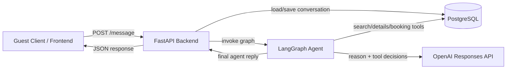

# StayEase AI Booking Agent

## 1. Architecture Document

### 1.1 System Overview
StayEase uses a small FastAPI backend to receive guest messages, load conversation history from PostgreSQL, and invoke a LangGraph agent that is limited to three actions: search properties, return listing details, and create a booking. The LangGraph agent uses the OpenAI Responses API as its reasoning layer and calls internal tools for property search, details lookup, and booking creation. Any request outside those three supported actions is routed to human handoff instead of being handled automatically. OpenAI documents the Responses API as its primary interface for stateful responses and tool use, which fits this bounded agent design well.

### 1.2 Conversation Flow
Example guest message: **"I need a room in Cox's Bazar for 2 nights for 2 guests."**

1. The frontend sends the message to `POST /api/chat/{conversation_id}/message`.
2. FastAPI stores the guest message in `conversations` and loads earlier turns for that `conversation_id`.
3. FastAPI builds the LangGraph state with the raw message, conversation history, and empty search/booking fields.
4. The router node sends the state to the OpenAI Responses API with a strict system instruction: only support `search`, `details`, and `book`; otherwise escalate.
5. The model classifies the intent as `search` and extracts:
   - `location = "Cox's Bazar"`
   - `check_in` and `check_out` or `nights = 2` pending date clarification
   - `guest_count = 2`
6. If dates are complete, the graph calls `search_available_properties`.
7. The search tool queries `listings` and filters by:
   - location match
   - capacity >= 2
   - availability for the requested stay
8. The tool returns a normalized list such as:
   - `SEA-201` — Beach View Studio — `BDT 6,800/night`
   - `SEA-318` — Kolatoli Family Suite — `BDT 8,500/night`
   - `SEA-122` — Budget Couple Room — `BDT 4,900/night`
9. The response node converts tool output into guest-friendly text with price, neighborhood, max guests, and booking cue.
10. FastAPI stores the assistant reply in `conversations` and returns the JSON payload to the frontend.

### 1.3 LangGraph State Design

| Field | Type | Why it exists |
|---|---|---|
| `conversation_id` | `str` | Ties one graph run to a persisted chat thread. |
| `messages` | `list[dict[str, str]]` | Preserves guest/assistant turns used for reasoning and API responses. |
| `latest_user_message` | `str` | Gives each node a stable input for intent detection and extraction. |
| `intent` | `Literal["search", "details", "book", "escalate"] \| None` | Stores the only four routing outcomes allowed in the graph. |
| `search_params` | `dict[str, Any]` | Holds normalized search inputs like location, dates, and guest count. |
| `selected_listing_id` | `str \| None` | Tracks which property the guest is asking about or booking. |
| `booking_request` | `dict[str, Any]` | Holds booking payload fields before tool execution. |
| `tool_result` | `dict[str, Any] \| None` | Carries structured output from the last tool call. |
| `response_text` | `str \| None` | Stores the final assistant reply returned to FastAPI. |
| `escalation_reason` | `str \| None` | Explains why unsupported requests must go to a human. |

### 1.4 Node Design

| Node | What it does | Updates in state | Next node |
|---|---|---|---|
| `route_request` | Detects whether the guest wants search, details, booking, or human escalation. | `intent`, `search_params`, `selected_listing_id`, `booking_request`, `escalation_reason` | `run_search_tool`, `run_details_tool`, `run_booking_tool`, or `finalize_response` |
| `run_search_tool` | Calls property search for valid location, dates, and guest count. | `tool_result` | `finalize_response` |
| `run_details_tool` | Fetches detailed information for one listing. | `tool_result` | `finalize_response` |
| `run_booking_tool` | Creates a booking for the selected listing and guest request. | `tool_result` | `finalize_response` |
| `finalize_response` | Formats a guest-safe response or human handoff message. | `response_text`, `messages` | `END` |

### 1.5 Tool Definitions

#### `search_available_properties`
- **Inputs**
  - `location: str`
  - `check_in: date`
  - `check_out: date`
  - `guest_count: int`
- **Output**
  - `{ "properties": [ { "listing_id": str, "title": str, "location": str, "price_bdt": int, "currency": "BDT", "max_guests": int, "available": bool } ], "count": int }`
- **Used when**
  - The agent has a search request with location, stay dates, and guest count.

#### `get_listing_details`
- **Inputs**
  - `listing_id: str`
- **Output**
  - `{ "listing_id": str, "title": str, "description": str, "location": str, "nightly_price_bdt": int, "amenities": list[str], "max_guests": int, "check_in_time": str, "check_out_time": str }`
- **Used when**
  - The guest asks about one specific property.

#### `create_booking`
- **Inputs**
  - `listing_id: str`
  - `check_in: date`
  - `check_out: date`
  - `guest_count: int`
  - `guest_name: str`
  - `guest_email: EmailStr`
- **Output**
  - `{ "booking_id": str, "status": "confirmed", "listing_id": str, "total_price_bdt": int, "currency": "BDT" }`
- **Used when**
  - The guest clearly confirms they want to book and required booking fields are present.

### 1.6 Database Schema Design

#### `listings`
| Column | Type |
|---|---|
| `id` | `UUID PRIMARY KEY` |
| `listing_code` | `VARCHAR(32) UNIQUE NOT NULL` |
| `title` | `VARCHAR(150) NOT NULL` |
| `description` | `TEXT NOT NULL` |
| `location` | `VARCHAR(120) NOT NULL` |
| `area` | `VARCHAR(120) NOT NULL` |
| `nightly_price_bdt` | `INTEGER NOT NULL` |
| `max_guests` | `INTEGER NOT NULL` |
| `amenities` | `JSONB NOT NULL` |
| `is_active` | `BOOLEAN NOT NULL DEFAULT TRUE` |
| `created_at` | `TIMESTAMPTZ NOT NULL` |

#### `bookings`
| Column | Type |
|---|---|
| `id` | `UUID PRIMARY KEY` |
| `booking_code` | `VARCHAR(32) UNIQUE NOT NULL` |
| `listing_id` | `UUID NOT NULL REFERENCES listings(id)` |
| `guest_name` | `VARCHAR(120) NOT NULL` |
| `guest_email` | `VARCHAR(255) NOT NULL` |
| `guest_count` | `INTEGER NOT NULL` |
| `check_in` | `DATE NOT NULL` |
| `check_out` | `DATE NOT NULL` |
| `total_price_bdt` | `INTEGER NOT NULL` |
| `status` | `VARCHAR(20) NOT NULL` |
| `created_at` | `TIMESTAMPTZ NOT NULL` |

#### `conversations`
| Column | Type |
|---|---|
| `id` | `UUID PRIMARY KEY` |
| `conversation_id` | `VARCHAR(64) NOT NULL` |
| `role` | `VARCHAR(20) NOT NULL` |
| `message_text` | `TEXT NOT NULL` |
| `intent` | `VARCHAR(20)` |
| `tool_name` | `VARCHAR(80)` |
| `created_at` | `TIMESTAMPTZ NOT NULL` |

## Implementation Notes
- FastAPI owns transport, validation, and persistence boundaries.
- LangGraph owns routing, tool invocation, and safe escalation.
- PostgreSQL owns listings, bookings, and full chat history.
- OpenAI Responses API owns intent reasoning and structured tool selection.

## References
- OpenAI Responses API: https://platform.openai.com/docs/api-reference/responses
- OpenAI Tools Guide: https://platform.openai.com/docs/guides/tools?api-mode=responses
- OpenAI Web Search Guide: https://platform.openai.com/docs/guides/tools-web-search?api-mode=responses
